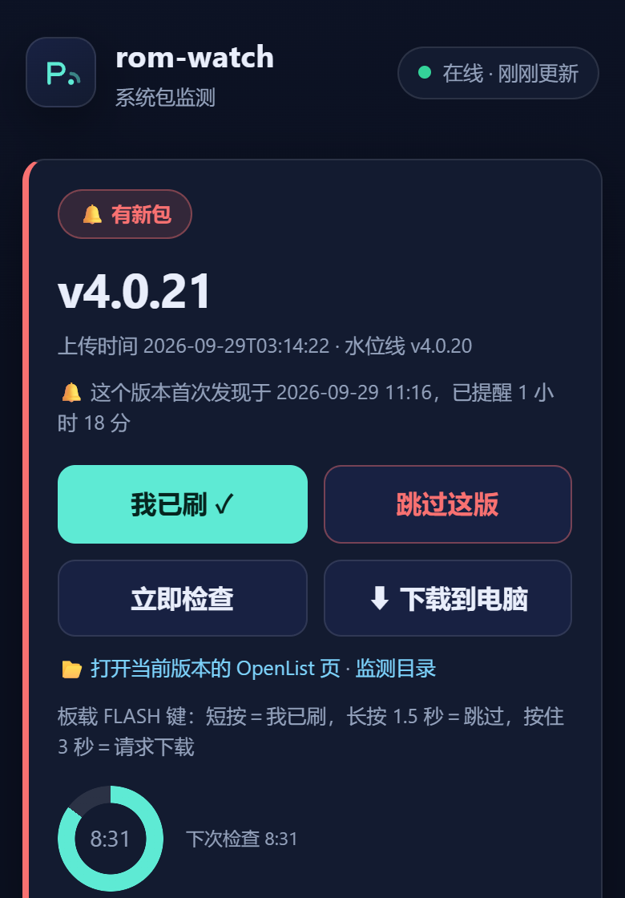

# rom-watch · ESP8266「新版本」监测看板

一块 **WeMos D1 mini（ESP8266）** 干三件事：**盯着某个目录/仓库有没有出新版本** → **板上 LED + 小屏 + 网页一起提醒** → **手机上按一下就知道刷没刷过**。

> 起因很朴素：某个网盘目录里会不定期上传新系统包，靠人肉去看太累。
> 这块板子 10 分钟查一次，有新包就亮灯、屏上换字、网页变红；刷完点一下「我已刷 ✓」就安静下来。

> 🇨🇳 **Gitee 镜像（国内访问更快）**：<https://gitee.com/cmyfqwq/rom-watch>
> （两边内容一致，Issue 提哪边都行；主仓库是 GitHub）

---

## 能干什么

| | 功能 | 说明 |
|---|---|---|
| 🔔 | **新版本提醒** | 板上 LED + 0.96" OLED + 网页面板三处同时提醒 |
| 🔀 | **数据源可换** | 内置 **OpenList 目录**（网盘）／**GitHub Release**／**自定义 JSON** 三种预设，网页上点一下就能换 |
| ✅ | **三级通知** | 「**我已刷**」（推进水位线，不再提醒）／「**跳过这版**」（只压住这一版）／「**我知道了（关灯）**」（先摁灭灯，页面照旧显示有新版本） |
| 🕐 | **水位线 + 首次发现** | 记住"你已经确认过的版本"，还能回答"这个版本**首次发现于**什么时候" |
| 🖥 | **网页看板** | 手机/电脑/电视都能开；带 `?kiosk=1` 看板模式与字号缩放 |
| 📟 | **串口屏可选** | 可外挂一块 TJC（淘晶驰）串口屏做更大的显示（`USE_TJC` 开关，不用就不编） |
| 🧰 | **一切可配** | 接线、屏幕尺寸、轮询间隔、数据源、标题、板型……**都只改一个 `config.h`** |

### 界面预览

| 网页面板（手机） | OLED 128×64（默认） | OLED 128×32（小屏） |
|---|---|---|
|  |  |  |

---

## 三分钟上手

**你需要**：WeMos D1 mini（或任意 ESP8266 开发板）+ 0.96" I2C OLED（SSD1306/SSD1315，地址 0x3C）+ 一根 USB 线。

```bash
# ① 拿代码
git clone https://github.com/cmyfqwq/rom-watch.git
cd rom-watch

# ② 配自己的值（★这一步必做，仓库里只有样板）
cd firmware/rom-watch
cp config.example.h config.h      # Windows: copy config.example.h config.h
#   然后编辑 config.h：填 WiFi，或把 PVT_WIFI_SET 留 0（开机走 AP 配网）

# ③ 装工具链（一次性）
arduino-cli config init
arduino-cli core install esp8266:esp8266        # 本仓库实测 3.1.2
arduino-cli lib install "ESP8266 and ESP32 OLED driver for SSD1306 displays"

# ④ 编译 + 上传
arduino-cli compile --fqbn esp8266:esp8266:d1_mini firmware/rom-watch
arduino-cli upload  --fqbn esp8266:esp8266:d1_mini -p <你的串口> firmware/rom-watch
```

**接上电之后**：浏览器打开板子的 IP（串口日志里会打印），在「**监测设置**」里填服务器和目录 → 保存 → 点「**立即检查**」。
有网盘（OpenList/alist）就用预设 `0`；想盯某个 GitHub 仓库就选预设 `1`，填 `OWNER/REPO`。

> 网页里点「**怎么用（3 步）**」有一份写给非程序员看的说明 ✓

---

## 接线（默认值）

| 从 | 到 | 说明 |
|---|---|---|
| OLED `SDA` | ESP **D2** | I2C 数据 |
| OLED `SCL` | ESP **D1** | I2C 时钟 |
| OLED `VCC` / `GND` | 3V3 / GND | 0.96" 屏一般 3.3V 就够 |
| 串口屏 `TX` | ESP **D5** | ★**可选**，`USE_TJC=1` 时才用 |
| 串口屏 `RX` | ESP **D7** | ★可选 |
| 串口屏 `VCC` / `GND` | **独立 5~12V** / 共地 | ⚠️ 屏工作电流 ~420mA，**别从板上取电** |
| 板载 LED | GPIO2 | 板子自带的那个，不用接 |
| FLASH 键 | GPIO0 | 板子自带的按键，长按/短按有不同动作 |

> ⚠️⚠️ **串口屏绝对不要接 D6（GPIO12）** —— 那是 ESP8266 **开机时判断 flash 电压**的脚，
> 被串口占着可能直接**起不来**。默认已经避开它了，改接线时别改回去。

**详细接线、换板子/换屏的步骤、排错对号入座** → [docs/接线与适配.md](docs/接线与适配.md)

---

## 适配层：换硬件只改 `config.h`

主文件里每个适配项都写成 `#ifndef`（**你定义了才覆盖**）⇒ 不写就走默认值，写了就生效，**主文件一个字不用动** ✓

| 宏 | 默认 | 什么时候改 |
|---|---|---|
| `PIN_OLED_SDA` / `PIN_OLED_SCL` | `D2` / `D1` | 换 I2C 引脚 |
| `OLED_ADDR` | `0x3C` | 少数模块是 `0x3D` |
| `OLED_SMALL` | `0` | 设 `1` ⇒ **128×32 小屏（0.91"）**，版面自动换成两行 |
| `PIN_TJC_RX` / `PIN_TJC_TX` | `D5` / `D7` | 换串口屏接线（★别用 D6） |
| `PIN_LED` / `PIN_BTN` | `LED_BUILTIN` / `D3` | 换板子 |
| `OTA_PASSWORD` | 源码里的**公开默认值** | ★**必须改** —— 写进 `config.h`（`tools/ota.py` 会**自动读它** ✓，只改一处） |
| `DFLT_HOST` / `DFLT_PATH` | 空 | 第一次开机的默认数据源（网页上随时能改；**留空是合法的**） |

板型/口令/串口也可以用**环境变量**覆盖，不用改脚本：

```bash
set ROMWATCH_FQBN=esp8266:esp8266:nodemcuv2
set ROMWATCH_OTA_PASS=你自己的口令
set ROMWATCH_PORT=COM7
```

---

## 编译开关与资源

这块板子 **IRAM 只有 64KB，全开就到 96%** ⇒ 做了编译开关：不用哪个就把哪个整块不编进来。

| 配置 | 编译开关 | RAM | IRAM | Flash |
|---|---|---|---|---|
| `full`（默认） | — | 49% | **96%** | 60% |
| `no_tjc` | `-DUSE_TJC=0` | 46% | 94% | 59% |
| `no_oled` | `-DUSE_OLED=0` | 49% | 96% | **50%** |
| `minimal` | 两个都 0 | 46% | 94% | 48% |
| `oled32` | `-DOLED_SMALL=1` | 49% | 96% | 60% |
| `portable` | **干净副本（不带 `config.h`）** | 49% | 96% | 60% |

```bash
python tools/build_matrix.py          # 一键跑上表全部配置，自己看实测数字
python tools/build_matrix.py --list   # 只列配置名
```

> `portable` 那一行是**"别人 clone 下来直接能编"的实测证据**：脚本把可公开的那几个文件复制到临时目录、
> **故意不带 `config.h`** 编一遍 ⇒ 编过了 ✓（不是嘴上说"能编"）

---

## 网页端点

动作类端点都是 **POST**（GET 会 404）。

| 端点 | 方法 | 干什么 |
|---|---|---|
| `/` | GET | 网页面板 |
| `/rom` | GET | 状态 JSON（页面每 5 秒拉一次，也方便脚本读） |
| `/status` `/ping` `/log` | GET | 设备信息 / 存活探测 / 纯文本日志（含"启动黑匣子"） |
| `/check` | POST | 立即检查（秒回，抓包挪到主循环做） |
| `/ack` `/skip` | POST | 我已刷 / 跳过这版 |
| `/seen` | POST | 我知道了（关灯）；`?clear=1` 撤销 |
| `/led?on=1\|0\|2` | GET | 手动点灯 15 秒（用来分辨"灯坏了"还是"逻辑不该亮"） |
| `/cfg` | POST | 改数据源/路径/间隔/标题 |
| `/i2c` | GET | 扫 I2C 总线（看 OLED 在不在） |
| `/tjcwire` `/tjcsweep` `/tjccmd?c=` | GET | 串口屏线路体检 / 扫波特率 / 发任意指令 |
| `/update` `/reset` `/reconfig` | GET/POST | 网页刷固件 / 清凭据 / 重新配网 |

---

## 常见问题

| 现象 | 先看这里 |
|---|---|
| **网页打不开** | 板子还在不在网？看串口日志里的 IP；AP 模式下面板在 `192.168.4.1` |
| **OLED 不亮 / 花屏** | `/i2c` 扫得到 `0x3C` 吗？扫不到就是接线/地址问题（试试 `OLED_ADDR=0x3D`） |
| **屏上字缺笔画** | 字模是从源码里的汉字自动生成的 ⇒ 你在源码里加了新汉字，**要重跑取模脚本** |
| **数据源一直失败** | `/rom` 的 `lastErr` 与「调试：最近响应片段」会直接告诉你原因；GitHub 预设**必须**带 User-Agent 且限流 60 次/小时 |
| **抓到的时间不对** | `/log` 看校时；没 NTP 时显示的是"开机计时" |
| **板子反复重启** | `/log` 看「上次跑到阶段」+ 启动次数（启动黑匣子存在 RTC 内存里，异常重启也不丢） |
| **IRAM 超了编不过** | 跑 `python tools/build_matrix.py`，把用不到的开关关掉 |

---

## 目录结构

```
serial-screen/
├── firmware/
│   ├── rom-watch/              # ★主固件
│   │   ├── rom-watch.ino       #   主程序
│   │   ├── web_ui.h            #   网页（整页装在 PROGMEM 里流式发出，服务端零动态渲染）
│   │   ├── cn_font.h           #   中文点阵（由脚本自动生成，勿手改）
│   │   ├── config.example.h    #   ★配置样板 —— 复制成 config.h 再改
│   │   └── config.h            #   你的私有配置（**不进仓库**）
│   └── ota-base/               # 无线 OTA 底座固件（保命用，可单独刷）
├── tools/
│   ├── build_matrix.py         # 多配置编译矩阵
│   ├── check_publish.py        # ★发布前自检（扫私有信息 + 算哪些文件会被提交）
│   └── ota.py                  # 一键 编译+无线推送+校验
├── docs/                       # 文档与配图
├── 开关与配置说明_rom-watch.md  # 更细的开关/EEPROM/端点说明
└── .gitignore
```

---

## 安全提醒 ⚠️

1. **改掉默认 OTA 口令** —— 默认值写在源码里，**同网段的任何人都能刷你的固件**。
   在 `config.h` 里加一行 `#define OTA_PASSWORD "换成你自己的"` 就行：
   `tools/ota.py` 会**自动读 `config.h` 里那一行**（环境变量 `ROMWATCH_OTA_PASS` 优先级更高），
   所以口令**只有一个真值源**，不用去改脚本 ✓
   （`firmware/ota-base/` 那块保命底座也支持同样的 `config.h` ✓ —— 否则刷一次底座就把口令打回原形 ✗）
2. **`config.h` 是你的私有文件**（WiFi 密码、服务器地址）—— 它已被 `.gitignore` 排除，**别手滑提交**。
3. **固件是明文 HTTP**（局域网内），不要直接暴露到公网；要远程访问请走内网穿透 + 鉴权。
4. **编译产物 `.bin` 里会内嵌你编译时的凭据** ⇒ `build/` 目录同样不进仓库。

**发布前自检**（会告诉你哪些文件会被提交、里面有没有私有信息）：

```bash
python tools/check_publish.py           # PASS 退出码 0 / FAIL 退出码 1
python tools/check_publish.py --list    # 顺便列出"会被提交的文件"清单
```

> 它用**真 git 的 ignore 语义**算（临时建仓跑 `check-ignore`，跑完即删，不碰你的 `.git`）；
> 你自己的私有字面量（WiFi 名/密码/域名）写在 `tools/.publish-secrets.txt`（**本地文件，不进仓库**）。

---

## 附带工具（`tools/`）

| 工具 | 干什么 |
|---|---|
| `ota.py` | 一键 **编译 + 无线推送(OTA) + 校验**；也能 `find` 找板子、`serial` 看日志、`rescue` 串口兜底 |
| `build_matrix.py` | 六配置编译矩阵，打印 RAM/IRAM/Flash 对比（含"不带 config.h 也能编"的 `portable` 验证） |
| `check_publish.py` | **发布前自检**：算出哪些文件会被提交 + 扫私有信息 |
| `verify_hmi.py` | 校验 TJC 工程文件（`.HMI`）的容器连续性/页数/控件/事件 |
| `hmi_parse.py` `hmi_pack.py` `hmi_page.py` | **TJC `.HMI` 格式的解析 / 打包 / 逐页操作**（这个格式官方没文档，是从文件结构反推的） |
| `hmi_gen.py` `hmi_templates.py` `hmi_comp.py` `hmi_drop_page.py` | 程序化生成/修改 TJC 工程（**不靠点上位机 GUI** ✓） |
| `pa_dump.py` `pa_dump2.py` | 把 `.HMI` 里的页面块（`.pa`）导出来看属性表 |

> ⚠️ 这批工具是针对 **TJC/Nextion 串口屏**的；只用 rom-watch 看板的话，前两个就够了。

---

## 许可证

**MIT** —— 见 [LICENSE](LICENSE)。可以自由使用、修改、分发（保留版权声明即可）。

## 相关文档

- [接线与适配](docs/接线与适配.md) —— 接线表、换板子/换屏步骤、排错
- [开关与配置说明](开关与配置说明_rom-watch.md) —— 编译开关、EEPROM 布局（红线）、端点、命令速查
- [config.example.h](firmware/rom-watch/config.example.h) —— 所有可配置项的注释样板
